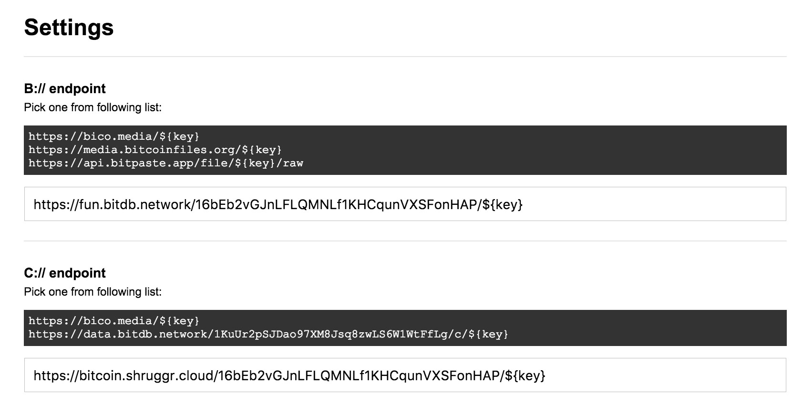
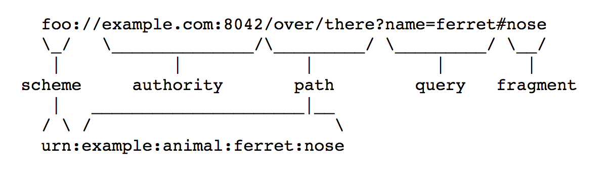
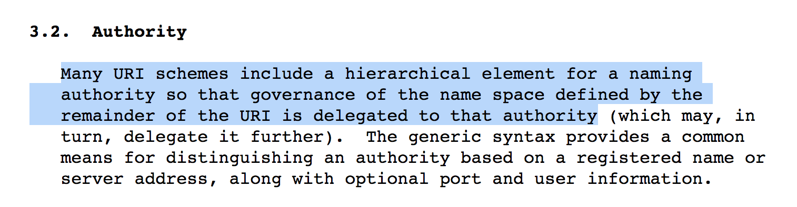

# bit://

> A Bitcoin Protocol Protocol

---

<div class='warning'>
<strong>Note</strong>
<br><br>
This is a pre-release proposal of the bit:// protocol specification.
<br><br>
Nothing is set in stone yet, the final spec will be decided after reasonable amount of feedback and discussion on the details. Please read through the document first, and then visit the [GitHub issues thread](https://github.com/interplanaria/bit/issues) to contribute to the discussion.
</div>

---

# Abstract


We are on the verge of an explosion of Bitcoin application protocols. But to realize their full potential, the protocols need an easy way to reference one another through a common URI scheme, creating a native network effect.

There have been attempts at creating URI schemes like [B://](https://b.bitdb.network) and [C://](https://c.bitdb.network), but they are each limited to their own specific use cases. Also, trying to come up with a new URI scheme for every new protocol is unsustainable and will require a centralized committee that manually curates the global protocol namespace. This is not ideal.

What is needed is a generic URI scheme that has the expressive power to reference any Bitcoin application protocol, and a global decentralized router that can resolve the URIs to relevant service providers in a frictionless and automated manner.

---

# Problem

While [Bitcom](https://bitcom.bitdb.network) addresses the problem of **"decentralized protocol registry"**, It does not address **"HOW the protocols are actually referenced and processed amongst interlinked Bitcoin-native documents and applications"**. 

There is currently no standard way for **publishers** and **developers** to reference various Bitcoin-native data objects in their **hypermedia documents** and **applications** using unique resource identifiers. Some developers have come up with URI schemes such as `B://`, `C://`, `D://`, `B://CAT`, etc. but the names are all arbitrary and there is no standard rule, and they require human consensus to avoid namespace collision, not to mention manual case-by-case implementation.

This beats the purpose of the [Bitcom protocol scheme](https://bitcom.bitdb.network). We have again ended up with the same namespace collision problem Bitcom was supposed to solve. We again have to worry about namespace collision, centralized curation, and non-scalability, just on a higher abstraction level.

What is needed is a framework to completely close the loop such that protocol creation, registration, reference, and governance can all be automated for markup languages, agents, browsers, etc., with no 3rd party middlemen. 

At a minimum, we need to solve the following problems:

1. **URI Scheme:** A uniform, collision-free, decentralized URI scheme for referencing and querying various Bitcoin protocols
2. **Router:** A standard for automatically interpreting and mapping URIs to real world service providers and governance bodies


## Problem 1. URI Scheme

Who decides that  `B://` is a legitimate URI scheme? How about`C://`? `D://`? What if someone later comes along and just decides to hijack existing URI schemes for their own protocol? Is it even the right approach to keep coming up with these arbitrary alphabet names on a first come first served basis?

We can't have yet another [IANA](https://www.iana.org/assignments/service-names-port-numbers/service-names-port-numbers.xml), the manual application-approval approach may have worked for the old web, but not in the new world of Bitcoin where every value transfer needs to be automated and frictionless.

Here are the qualities we need in a decentralized URI scheme:

1. **Collision Free:** We should be sufficiently confident that not a single URI scheme collides with any other URI schemes within the framework.
2. **Zero Friction:** The URI scheme publication and registration process should be automated. It SHOULD NOT require asking for human approval (Example: [IANA](https://www.iana.org/assignments/service-names-port-numbers/service-names-port-numbers.xml)). Manual curation introduces friction. The goal of Bitcoin is to get rid of friction in all types of value transfers. We need to replace manual curation with automated market-driven curation.
3. **Zero Middleman:** The system should not result in centralization of power. This means no centralized committee and no centralized registry for URI schemes.
4. **Machine Friendly:** A machine or a program should be able to not only give birth to its own protocol but also publicly register the URI scheme automatically, by default supporting interoperability with other protocols. It should be possible to automate everything, even the creation and publication of protocols themselves.


## Problem 2. Router

Coming up with the naming scheme is only half the story. Without a way to automatically interpret and route the protocol schemes to relevant service providers, we still end up with the same problem of requiring middlemen since SOMEONE needs to maintain the routes manually.

As an example let's think about how [Bottle browser](https://bottle.bitdb.network) interprets URI schemes like [B://](https://b.bitdb.network) or [C://](https://c.bitdb.network). 

Currently Bottle has a list of Protocol-to-Service mappings hardcoded from which the user can choose one, like this:



Today this list is hardcoded into the browser and is still manageable because there are only a small number of protocols (B:// and C://) and small number of service providers per protocol (bico, bitcoinfiles, bitpaste, etc.), but in the future there will be more protocols, and more service providers per protocol, making this unscalable.

What is needed is a **decentralized open standard for mapping Bitcoin application protocol URIs to real world service providers**, allowing browsers and autonomous agents to automatically process protocols without a 3rd party.

---

# Solution

There are three parts to the solution

1. **Generic URI Scheme:** A new expressive URI scheme that can custom-reference any Bitcoin app protocol object on the blockchain.
2. **Decentralized Router:** A decentralized routing engine that maps the generic URI scheme to real world service providers who implement each protocol, using [Bitcom](https://bitcom.bitdb.network).
3. **Authentication:** A two-way mechanism to connect service endpoints to the router with provable ownership and affiliation, using [Bitcoin Sticker protocol](https://sticker.planaria.network).


## 1. Generic URI Scheme

### A. How it Works

We introduce a new generic URI scheme that can describe all Bitcoin app protocols without collision, **"a protocol protocol"**, if you will.

Let's take a [B://](https://b.bitdb.network) asset as an example to explain this concept:

```
b://9f34f9f27ed6630951efd672872b76972e332e93c66c65f29ba7381b45a0abe7
```

We are going to express above asset in terms of the new generic URI scheme: `bit`:

```
bit://19HxigV4QyBv3tHpQVcUEQyq1pzZVdoAut/9f34f9f27ed6630951efd672872b76972e332e93c66c65f29ba7381b45a0abe7
```

Note that the URI is structured in the following way:

```
bit://[B: Bitcom Address]/[Transaction ID]
```

where:

- `19HxigV4QyBv3tHpQVcUEQyq1pzZVdoAut`: B:// Bitcom Address
- `9f34f9f27ed6630951efd672872b76972e332e93c66c65f29ba7381b45a0abe7`: Transaction ID for the B asset

We retire the `b` prefix, and use the Bitcom address as the unique identifier instead. We no longer have the namespace collision problem.


Also, this is in 100% accordance with RFC3986 [generic URI syntax](https://tools.ietf.org/html/rfc3986#section-3):



where:

- **scheme:** `bit` (The universal "protocol protocol")
- **authority:** `19HxigV4QyBv3tHpQVcUEQyq1pzZVdoAut` (The Bitcom address for `B://` protocol)
- **path:** `9f34f9f27ed6630951efd672872b76972e332e93c66c65f29ba7381b45a0abe7` (The transaction id)


### B. Features

#### 1. Flexibility

The `bit://` scheme is as expressive as any typical web api endpoint. 

The route is not constrained to a single level path, you can create sophisticated multi-level paths.

Instead of:

```
bit://[B Bitcom Address]/[txid]
```

You can create more semantically expressive patterns such as:

```
bit://[B Bitcom Address]/file/[txid]
```


#### 2. Multiple Routes per Protocol

We can go further. Since we now have the expressive power of any web api router, we are not constrained to one route per protocol.

For example let's take a look at a hypothetical implementation of the [MAP protocol](https://github.com/rohenaz/MAP) (Bitcom address `1PuQa7K62MiKCtssSLKy1kh56WWU7MtUR5`)

We could have multiple routes for the protocol, each of which returns a different response:

```
bit://[MAP Protocol Bitcom Address]/user/[User Bitcoin Address]
bit://[MAP Protocol Bitcom Address]/tx/[Txid]
```

which in practice would work something like this:

```
bit://1PuQa7K62MiKCtssSLKy1kh56WWU7MtUR5/user/15PciHG22SNLQJXMoSUaWVi7WSqc7hCfva
bit://1PuQa7K62MiKCtssSLKy1kh56WWU7MtUR5/tx/bbdc98852b99aaecef24925883c960457932affc83972f128e0c2361a444aace
```


#### 3. Dynamic APIs

Bit:// is a full fledged URI scheme with full fledged routing ability.

This means we are not limited to referencing static files.

It is possible to design the route to reference dynamic API endpoints with immutable ruleset, which can be very useful.


## 2. Decentralized Router

### A. Design goals

Coming up with a URI naming convention is the easy part. The hard part is the **actual specification of how each URI scheme is interpreted and processed automatically, also known as routing**.

Without this part, someone needs to manage this list manually, and we would still need a centralized directory listing of various service providers that implement these protocols. This means agents and browsers won't be able to process the URIs in an automated manner.

Let's revisit the MAP protocol example from above. We need a way to route the protocol URIs to corresponding service endpoints

- **bit://1PuQa7K62MiKCtssSLKy1kh56WWU7MtUR5/user/15PciHG22SNLQJXMoSUaWVi7WSqc7hCfva**
  - **Behavior:** route to service endpoints that return all MAP protocol usage from user `15PciHG22SNLQJXMoSUaWVi7WSqc7hCfva`
- **bit://1PuQa7K62MiKCtssSLKy1kh56WWU7MtUR5/tx/bbdc98852b99aaecef24925883c960457932affc83972f128e0c2361a444aace**
  - **Behavior:** route to service endpoints that return the MAP portion of the transaction `bbdc98852b99aaecef24925883c960457932affc83972f128e0c2361a444aace`

A couple of things to note:

1. The behavior of each route needs to be defined by the protocol admin (the one who owns the private key to the Bitcom address) through their public protocol specification documentation.
2. It is assumed that all service providers who implement and register their protocol handler endpoints to the router precisely follow the protocol.
3. The enforcement (determining whether a service endpoint has actually correctly implemented the protocol) is not part of the bit:// scheme and Bitcom router. This will need to be built as a separate layer. For example, it can be left up to the end user to choose which service provider to connect to, or it can be automated based on the user preference or other factors.

### B. Client-Server vs. Bitcoin

In coming up with a solution, we can learn from existing battle-tested systems. For this let's take a look at how the existing Internet URI system works. Here's how RFC3986 defines the [authority](https://tools.ietf.org/html/rfc3986#section-3.2) of a URI:




The important part:

> ... governance of the name space defined by the remainder of the URI is delegated to that authority.


This means the "authority" (the server) decides how to interpret the rest of the URI. In the following example, the server at  `example:8042` (the authority) implements a backend application that custom-processes `/over/there` (the path).


For example: "**twitter.com**", "**wikipedia.org**", etc. are authorities. The "governance" (application logic) of the request is delegated to the "authority" (the web server behind the domain). 

The web server implements a set of router logic in their backend to map each request to the matching response handler. Example:

```
twitter.com authority router

/:username
	=> [Behavior] return user feed
/:username/following
	=> [Behavior] return the list of accounts this user is following
/:username/followers
	=> [Behavior] return the list of accounts following this user
...
```

In the old client-server model, this router logic is implemented as a private backend, owned by whichever organization owns the domain.

However in the new Bitcoin world, the architecture is different. There is no private backend. The private backend is replaced with public application protocols which interpret Bitcoin into multiple service-able endpoints.

We need to invent a way to do the same thing for Bitcoin apps, while keeping in mind the difference:

1. **The Server-Client Pardigm:** the router forwards requests to the relevant backend application logic which lives on a server run by the same organization.
2. **The Bitcoin Paradigm:** the router forwards requests to various service providers that implement the application protocol. The "router" itself exists on the blockchain, and the service providers are unbundled from the router.

Let's imagine a global routing table that looks something like this:

| Protocol Name | Bitcom Address                     | API MAPPING                                                  |
| ------------- | ---------------------------------- | ------------------------------------------------------------ |
| B             | 19HxigV4QyBv3tHpQVcUEQyq1pzZVdoAut | https://bico.media/${key}                                    |
| B             | 19HxigV4QyBv3tHpQVcUEQyq1pzZVdoAut | https://media.bitcoinfiles.org/${key}                        |
| B             | 19HxigV4QyBv3tHpQVcUEQyq1pzZVdoAut | https://api.bitpaste.app/file/${key}/raw                     |

Here's how we want it to work:

1. The protocol admin creates a protocol with Bitcom, makes [a "useradd" transaction](https://bitcom.bitdb.network/#/?id=_2-create-an-account) to publish the protocol
2. Various service providers implement protocol endpoints, precisely following the protocol spec
3. The service providers plug in their service endpoints to the Bitcom route.


### C. Implementation

#### 1. Enabling Routes

Only the admin of a protocol (The party who owns the private key to the Bitcom address) can enable `bit://` routes.

Let's say the MAP protocol creator wanted to open up two routes:

```
bit://[MAP Protocol Bitcom Address]/user/:user
bit://[MAP Protocol Bitcom Address]/tx/:tx
```

To enable routes, we introduce an additional command to [Bitcom](https://bitcom.bitdb.network): `route enable`.

```
OP_RETURN $ route enable /user/:user
OP_RETURN $ route enable /tx/:tx
```

Once these OP_RETURN transactions are mined, the admin has successfully published that the routes are open for business, and that any service provider can implement the protocol and plug in their endpoints.

Here's a [Bitquery](https://docs.planaria.network/#/query) that can filter all the enabled routes for B:// protocol (Bitcom address `19HxigV4QyBv3tHpQVcUEQyq1pzZVdoAut`):

```
{
  "v": 3,
  "q": {
    "find": {
      "in.e.a": "19HxigV4QyBv3tHpQVcUEQyq1pzZVdoAut",
      "out.s1": "$",
      "out.s2": "route",
      "out.s3": "enable"
    }
  }
}
```

#### 2. Adding an Endpoint to a Route

Once the admin enables the routes, anyone can implement the protocol and provide a service for each route by plugging in their endpoints.

To add your service endpoint to a Bitcom protocol route, we introduce an additional command to [Bitcom](https://bitcom.bitdb.network): `route add`.

```
$ route add [authority] [path] [handler]
```

Note that the EXACT `[path]` pattern must have been enabled by the protocol admin through the `route enable` command from the last section.

Below are some examples where service providers are adding routes from [B://](https://b.bitdb.network) protocol (`19HxigV4QyBv3tHpQVcUEQyq1pzZVdoAut`) to their service endpoints.

```
OP_RETURN $ route add 19HxigV4QyBv3tHpQVcUEQyq1pzZVdoAut /:tx https://bico.media/${tx}
```

```
OP_RETURN $ route add 19HxigV4QyBv3tHpQVcUEQyq1pzZVdoAut /:tx https://api.bitpaste.app/${tx}/raw
```

```
OP_RETURN $ route add 19HxigV4QyBv3tHpQVcUEQyq1pzZVdoAut /:tx https://media.bitcoinfiles.org/${tx}
```

> NOTE 1: We're assuming here that each transaction is sent by the owner of each HTTP endpoint
>
> NOTE 2: The path uses a typical route matcher syntax, for example :id means it's a named variable mapping to id.
> 
> NOTE 3: The handler uses a template expression to instantiate the service URL using the variable from the matched route. For example, ${tx} gets instantiated with the :tx variable matched from the route

Here's a [Bitquery](https://docs.planaria.network/#/query) to query all the service providers plugged into B:// protocol (Bitcom address `19HxigV4QyBv3tHpQVcUEQyq1pzZVdoAut`):

```
{
  "v": 3,
  "q": {
    "find": {
      "out.s1": "$",
      "out.s2": "route",
      "out.s3": "add",
      "out.s4": "19HxigV4QyBv3tHpQVcUEQyq1pzZVdoAut"
    }
  }
}
```

You can also create routes with even more flexible patterns:

```
OP_RETURN $ route add 1FnauZ9aUH2Bex6JzdcV4eNX7oLSSEbxtN /q/:tx https://test.net/query/${query}
OP_RETURN $ route add 1FnauZ9aUH2Bex6JzdcV4eNX7oLSSEbxtN /info/:tx https://test.net/info/${tx}
```

## 3. Route Authentication

### A. Proof of Ownership

One problem that arises from this approach is that anyone can make these `route add` transactions. There is no way to guarantee that the following transaction was actually created by the owner of `https://bico.media`:

```
OP_RETURN $ route add 19HxigV4QyBv3tHpQVcUEQyq1pzZVdoAut /:tx https://bico.media/:tx
```

We need a way for the service endpoint owner to prove that they actually have created the `route add` transaction linking to the exact endpoint, and vice versa.


### B. Implementation

For this we can use the [Bitcoin Sticker Protocol](https://sticker.planaria.network). The service provider can prove that their HTTP endpoint is associated with the `route add` transaction sender Bitcoin address by including a `bitcoin-address` attribute in the response header for the URL `https://bico.media/:tx`.


Here's are the hypothetical steps:


#### Step 1. Initialize

Initialize a Bitcom account with `bit init`. Let's say it has generated the address `1ApeFekX4JJLxiK991KHkTSJe9zFTunNHx`.


#### Step 2. route add

Now we can register the service:

```
OP_RETURN $ route add 19HxigV4QyBv3tHpQVcUEQyq1pzZVdoAut /:tx https://bico.media/:tx
```

Since this transaction was made from the address generated in step 1 (`1ApeFekX4JJLxiK991KHkTSJe9zFTunNHx`), we need to prove that `https://bico.media/:tx` is owned by `1ApeFekX4JJLxiK991KHkTSJe9zFTunNHx`.

#### Step 3. Sticker Protocol

There can be various approaches, but the simplest approach is to just include the Bitcoin address in the header as a [Bitcoin Sticker Protocol](https://sticker.planaria.network).

Implement sticker protocol header (Notice the last line where it includes the `bitcoin-address` field)

```
HTTP/1.1 200 OK
server: nginx/1.15.5 (Ubuntu)
date: Sun, 31 Mar 2019 19:21:05 GMT'
content-type: image/jpeg
content-length: 90887
connection: close
x-powered-by: Express
access-control-allow-origin: *
bitcoin-address: 1ApeFekX4JJLxiK991KHkTSJe9zFTunNHx
```


#### Step 4. Spam Free Routing Table

As we saw above, a naive routing table can be constructed with the following Bitquery:

```
{
  "v": 3,
  "q": {
    "find": {
      "out.s1": "$",
      "out.s2": "route",
      "out.s3": "add",
      "out.s4": "19HxigV4QyBv3tHpQVcUEQyq1pzZVdoAut"
    }
  }
}
```

But this time we can remove unauthenticated results by constructing a state machine (using [Planaria](https://planaria.network) or any other approach) that constantly checks each endpoint in the raw registry list.

The machine can check the header to make sure:

1. the endpoint is up.
2. the response header includes the Bitcoin address.

For example, let's say the above bitquery has returned 3 results for B:// protocol


```
{
  "c": [{
    "in": [{
      "e": {
        "a": "ADDR0", ...
      }
    }],
    "blk": { ... },
    "out": [{
      "b0": { "op": 106 },
      "s1": "$",
      "s2": "route",
      "s3": "add",
      "s4": "19HxigV4QyBv3tHpQVcUEQyq1pzZVdoAut",
      "s5": "/:tx",
      "s6": "https://bico.media/${tx}"
    }]
  }, {
    "in": [{
      "e": {
        "a": "ADDR1", ...
      }
    }],
    "blk": { ... },
    "out": [{
      "b0": { "op": 106 },
      "s1": "$",
      "s2": "route",
      "s3": "add",
      "s4": "19HxigV4QyBv3tHpQVcUEQyq1pzZVdoAut",
      "s5": "/:tx",
      "s6": "https://api.bitpaste.app/${tx}/raw"
    }]
  }, {
    "in": [{
      "e": {
        "a": "ADDR2", ...
      }
    }],
    "blk": { ... },
    "out": [{
      "b0": { "op": 106 },
      "s1": "$",
      "s2": "route",
      "s3": "add",
      "s4": "19HxigV4QyBv3tHpQVcUEQyq1pzZVdoAut",
      "s5": "/:tx",
      "s6": "https://media.bitcoinfiles.org/${tx}"
    }]
  }]
}
```

We can set up a cron task or a Planaria `onblock` handler that:

1. Loops through the items and makes a request to each `out[0].s6` attribute
2. Checks that the response header contains an attribute named `bitcoin-address` that matches the `in[0].e.a`


---


# FAQ

## Is this DNS?

No. This is more low level. Using the Internet analogy, it's closer to the IP address system, but for Bitcoin protocols.

A more human-readable namespaces can be built on top of this layer.

## Who is this for?

- **Application protocol developers:** Application developers can create their own protocol AND create URI schemes for referencing various data objects produced from their protocol transactions.
- **Service providers:** Service providers (Not to be confused with application developers) can implement the protocols and connect their service nods to the global router for discovery.
- **Agents:** Agents can parse the blockchain with the protocol to get more information about all the protocols and the global namespace.
- **Browsers:** A browser can use the bit:// protocol to render the Bitcoin universe to end-users.
